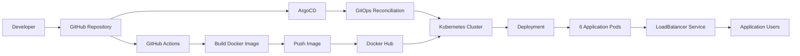

# GitOps CI/CD with GitHub Actions, Docker, Kubernetes & ArgoCD


A GitOps-based CI/CD project that demonstrates how to build, containerize,
publish, and deploy a Node.js application to Kubernetes using modern DevOps
practices.

The project separates the application build process from the deployment
process:

**GitHub Actions** handles CI and container image delivery.

**ArgoCD** handles GitOps-based continuous delivery to Kubernetes.

---

## 1. Project Overview

This project demonstrates an automated delivery workflow for a containerized
Node.js application.

The application runs inside Docker and gets deployed to a Kubernetes cluster.

The repository stores both application source code and Kubernetes manifests,
allowing Git to act as the source of truth for the desired application state.

### Project Goals

- Automate Docker image builds.
- Push application images to Docker Hub.
- Containerize a Node.js application.
- Deploy the application to Kubernetes.
- Manage Kubernetes configuration through Git.
- Use ArgoCD for GitOps-based continuous delivery.
- Maintain a repeatable and version-controlled deployment process.
- Demonstrate practical CI/CD and Kubernetes operations.

---

## 2. Architecture Overview



### Delivery Flow

```text
Developer
   |
   v
GitHub
   |
   v
GitHub Actions
   |
   +--> Build Docker Image
   |
   +--> Push Image to Docker Hub
   |
   v
Git Repository
   |
   v
ArgoCD
   |
   +--> Detect desired state
   |
   +--> Reconcile Kubernetes
   |
   v
Kubernetes
   |
   v
6 Application Replicas
   |
   v
LoadBalancer
```

The key GitOps principle is:

> Git stores the desired Kubernetes state, while ArgoCD continuously
> reconciles that state with the Kubernetes cluster.

---

## 3. Project Structure

```text
.
├── .github/
│   └── workflows/
│       └── main.yml
│
├── kubernetes/
│   ├── app.yaml
│   └── svc.yaml
│
├── public/
│   └── index.html
│
├── Dockerfile
├── app.js
├── package.json
└── README.md
```

### Directory Responsibilities

| Path | Responsibility |
|---|---|
| `.github/workflows/main.yml` | GitHub Actions CI pipeline |
| `kubernetes/app.yaml` | Kubernetes Deployment |
| `kubernetes/svc.yaml` | Kubernetes Service |
| `public/` | Application static content |
| `Dockerfile` | Container image definition |
| `app.js` | Node.js / Express application |
| `package.json` | Application dependencies and scripts |
| `README.md` | Project documentation |

---

## 4. Technology Stack

### Application

- Node.js
- Express.js
- JavaScript
- Body Parser
- HTML/CSS/Static assets

### Containerization

- Docker
- Docker Hub

### CI/CD

- GitHub Actions
- GitOps
- ArgoCD

### Container Orchestration

- Kubernetes
- Kubernetes Deployment
- Kubernetes Service
- LoadBalancer

### Source Control

- Git
- GitHub

---

## 5. CI Pipeline

The CI pipeline is defined in:

```text
.github/workflows/main.yml
```

The workflow runs when changes are pushed to the `Master` branch.

### CI Process

```text
Git Push
   |
   v
GitHub Actions
   |
   v
Checkout Repository
   |
   v
Docker Hub Authentication
   |
   v
Docker Build
   |
   v
Docker Push
   |
   v
Docker Hub
```

### Pipeline Responsibilities

1. Checkout the application source code.
2. Authenticate with Docker Hub.
3. Build the Docker image.
4. Tag the image as:

```text
3booda24/myapp1:latest
```

5. Push the image to Docker Hub.

Docker Hub credentials should remain stored in GitHub Secrets.

Required secrets:

```text
DOCKER_USERNAME
DOCKER_PASSWORD
```

Never hard-code credentials inside the workflow.

---

## 6. Deployment Setup

### Prerequisites

Install and configure:

- Docker
- kubectl
- Kubernetes cluster
- ArgoCD
- Git
- GitHub account
- Docker Hub account

Verify the tools:

```bash
docker --version
kubectl version --client
argocd version --client
git --version
```

---

### Step 1 — Clone the Repository

```bash
git clone https://github.com/abdelrahmanonline4/GitOps-CI-CD-with-GitHub-Actions-and-ArgoCD.git

cd GitOps-CI-CD-with-GitHub-Actions-and-ArgoCD
```

---

### Step 2 — Build the Application Locally

```bash
npm install
npm start
```

The application listens on:

```text
http://localhost:3000
```

---

### Step 3 — Build the Docker Image

```bash
docker build -t 3booda24/myapp1:latest .
```

Verify the image:

```bash
docker images
```

Run the container:

```bash
docker run -p 3000:3000 3booda24/myapp1:latest
```

Test:

```bash
curl http://localhost:3000
```

---

### Step 4 — Deploy Kubernetes Resources

Apply the Deployment:

```bash
kubectl apply -f kubernetes/app.yaml
```

Apply the Service:

```bash
kubectl apply -f kubernetes/svc.yaml
```

Verify:

```bash
kubectl get deployments
kubectl get pods
kubectl get services
```

The Deployment runs:

```text
6 replicas
```

The application container listens on:

```text
3000
```

The Kubernetes Service exposes:

```text
80
```

---

### Step 5 — Install ArgoCD

Create the ArgoCD namespace:

```bash
kubectl create namespace argocd
```

Install ArgoCD:

```bash
kubectl apply \
  -n argocd \
  -f https://raw.githubusercontent.com/argoproj/argo-cd/stable/manifests/install.yaml
```

Verify the installation:

```bash
kubectl get pods -n argocd
```

Wait until the ArgoCD components become ready.

---

### Step 6 — Access ArgoCD

Port-forward the ArgoCD server:

```bash
kubectl port-forward \
  svc/argocd-server \
  8080:443 \
  -n argocd
```

Access:

```text
https://localhost:8080
```

Retrieve the initial admin password:

```bash
kubectl get secret \
  argocd-initial-admin-secret \
  -n argocd \
  -o jsonpath="{.data.password}" | base64 -d
```

---

### Step 7 — Connect ArgoCD to GitHub

Configure ArgoCD to watch:

```text
https://github.com/abdelrahmanonline4/GitOps-CI-CD-with-GitHub-Actions-and-ArgoCD.git
```

Use:

```text
Repository: GitHub repository
Branch: Master
Path: kubernetes/
```

ArgoCD should monitor the Kubernetes manifests stored under:

```text
kubernetes/
```

---

### Step 8 — GitOps Deployment

Once ArgoCD monitors the repository, the deployment model becomes:

```text
Git Commit
    |
    v
GitHub
    |
    v
ArgoCD detects desired-state changes
    |
    v
ArgoCD reconciles Kubernetes
    |
    v
Kubernetes Deployment
```

This removes the need to manually run:

```bash
kubectl apply
```

for every Git-based deployment change.

---

## 7. Kubernetes Configuration

### Deployment

The application is deployed through:

```text
kubernetes/app.yaml
```

The Deployment provides:

- Kubernetes-native application management.
- 6 application replicas.
- Container port `3000`.
- Automatic image pulling.
- Replica management.

Check the Deployment:

```bash
kubectl get deployment my-app
```

Check the Pods:

```bash
kubectl get pods -l app=my-app
```

---

### Service

The application is exposed through:

```text
kubernetes/svc.yaml
```

The Service uses:

```text
Type: LoadBalancer
Port: 80
TargetPort: 3000
```

Check the Service:

```bash
kubectl get svc my-app-service
```

---

## 8. Troubleshooting

### GitHub Actions Fails During Docker Login

Check:

```text
DOCKER_USERNAME
DOCKER_PASSWORD
```

Verify that both values exist in:

```text
GitHub → Settings → Secrets and variables → Actions
```

Do not expose credentials inside workflow files.

---

### Docker Image Does Not Build

Run locally:

```bash
docker build -t 3booda24/myapp1:latest .
```

Check:

```bash
docker --version
```

Check the Dockerfile:

```text
Dockerfile
```

Verify that `package.json` exists in the build context.

---

### Pod Is Not Running

Check:

```bash
kubectl get pods
```

Then inspect the failing Pod:

```bash
kubectl describe pod <pod-name>
```

Check container logs:

```bash
kubectl logs <pod-name>
```

Check recent cluster events:

```bash
kubectl get events --sort-by=.lastTimestamp
```

---

### ImagePullBackOff

Check:

```bash
kubectl describe pod <pod-name>
```

Verify:

```text
Image name
Image tag
Docker Hub availability
Registry authentication
```

Check the image manually:

```bash
docker pull 3booda24/myapp1:latest
```

---

### Application Is Not Reachable

Check the Service:

```bash
kubectl get svc my-app-service
```

Check the Pods:

```bash
kubectl get pods -l app=my-app
```

Check the Service endpoints:

```bash
kubectl get endpoints my-app-service
```

Confirm that the application listens on:

```text
3000
```

---

### ArgoCD Does Not Detect Changes

Check ArgoCD application status:

```bash
argocd app list
```

Check:

```bash
argocd app get <application-name>
```

Force a refresh:

```bash
argocd app refresh <application-name>
```

Sync the application:

```bash
argocd app sync <application-name>
```

Verify that ArgoCD points to:

```text
Branch: Master
Path: kubernetes/
```

---

### Kubernetes Resources Are Out of Sync

Check:

```bash
kubectl get all
```

Compare the repository manifests with the cluster state.

Then check ArgoCD:

```bash
argocd app diff <application-name>
```

The Git repository should remain the source of truth.

---

## 9. DevOps Practices Demonstrated

This project demonstrates practical DevOps capabilities across the software
delivery lifecycle.

### Continuous Integration

- Automated GitHub Actions workflow.
- Automated Docker image builds.
- Automated Docker Hub publishing.
- Secret-based registry authentication.

### Containerization

- Docker-based application packaging.
- Reproducible application runtime.
- Container-to-Kubernetes delivery.

### Kubernetes

- Declarative infrastructure.
- Deployment management.
- Replica management.
- Service exposure.
- Container orchestration.

### GitOps

- Kubernetes desired state stored in Git.
- ArgoCD reconciliation.
- Version-controlled deployment configuration.
- Git as the deployment source of truth.

### Automation

The delivery process minimizes manual deployment operations:

```text
Code
  ↓
GitHub
  ↓
GitHub Actions
  ↓
Docker Image
  ↓
Docker Hub
  ↓
ArgoCD
  ↓
Kubernetes
```

---

## 10. Operational Verification

After deployment, validate the environment with:

```bash
kubectl get nodes
kubectl get pods
kubectl get deployments
kubectl get services
```

Check application logs:

```bash
kubectl logs -l app=my-app
```

Check rollout status:

```bash
kubectl rollout status deployment/my-app
```

Check the current image:

```bash
kubectl get deployment my-app \
  -o=jsonpath='{.spec.template.spec.containers[0].image}'
```

---

## 11. Rollback

Kubernetes maintains Deployment rollout history.

View rollout history:

```bash
kubectl rollout history deployment/my-app
```

Rollback:

```bash
kubectl rollout undo deployment/my-app
```

Verify:

```bash
kubectl rollout status deployment/my-app
```

For GitOps environments, the preferred rollback model is to revert the
Git change and allow ArgoCD to reconcile the cluster back to the previous
desired state.

---

## 12. Key Engineering Outcomes

This project demonstrates the ability to:

- Design an automated CI/CD workflow.
- Build and publish container images.
- Manage Kubernetes workloads declaratively.
- Implement GitOps deployment practices.
- Separate CI responsibilities from CD responsibilities.
- Manage credentials through CI/CD secrets.
- Diagnose Kubernetes deployment failures.
- Verify application rollouts.
- Perform controlled rollbacks.
- Maintain Git as the source of truth.

---

## 13. Future Improvements

Potential production hardening includes:

- Replace `latest` tags with immutable image tags such as Git commit SHA.
- Upgrade the Node.js runtime from Node 14 to a supported LTS version.
- Add automated unit and integration tests.
- Add container vulnerability scanning.
- Add Kubernetes readiness and liveness probes.
- Add CPU and memory requests/limits.
- Add CI quality gates.
- Add image signing and verification.
- Use GitHub OIDC instead of long-lived credentials where supported.
- Add separate development, staging, and production environments.
- Add monitoring and alerting.
- Add centralized logging.
- Add automated deployment verification.
- Add controlled promotion and rollback workflows.

---

## 14. Project Skills

```text
DevOps
CI/CD
GitOps
GitHub Actions
Docker
Docker Hub
Kubernetes
ArgoCD
Linux
Git
Containerization
Infrastructure as Code principles
Deployment Automation
Troubleshooting
Release Management
Rollback
```

---

## 15. Author

**Abdelrahman**

DevOps Engineer | DevSecOps | SRE | Instructor

Focused on:

```text
CI/CD
Cloud
Kubernetes
Docker
GitOps
Infrastructure Automation
DevSecOps
SRE
Observability
Reliability Engineering
```
